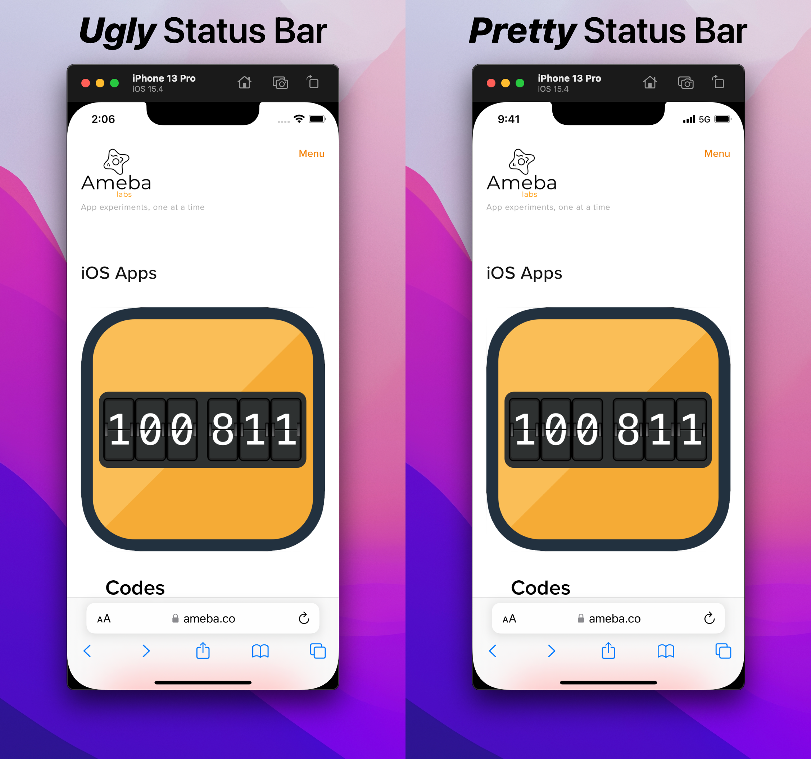

<p align="center">
 
</p>

# Nine Forty One

This app does one thing, keeps the status bar in Simulator nice and tidy. Like this:

<p align="center">
 
</p>

## How to get 9:41
Download from [GitHub Releases](https://github.com/amebalabs/NineFortyOne/releases)

or Install with Homebrew

```
brew install melonamin/formulae/ninefortyone
```

# How it works

9:41 lives in the menu bar and automatically change(runs periodically) the status bar in all runnning Simulators. To disable 9:41 just click on the icon, clicking on the icon again will re-enable the app.

You can access app's preferences using right click:

<p align="center">
 
</p>

## More Apps

If you enjoy 9:41 you may like these as well:
* [TRex](https://github.com/amebalabs/TRex) - Easy to use text extraction tool for macOS
* [Esse](https://github.com/amebalabs/Esse) - Swiss army knife of text transformation for iOS and macOS
* [SwiftBar](https://github.com/swiftbar/SwiftBar) - Powerful macOS menu bar customization tool
